 
# **DIAGRAMA DE FLUJO**

Se basan en la utilización de diversos símbolos para representar operaciones específicas. Se les llama diagramas de flujo porque los símbolos utilizados se conectan por medio de flechas para indicar la secuencia de operación.
La simbología utilizada para la elaboración de diagramas de flujo es variable y debe ajustarse a un patrón definido previamente.

### **Ejemplo:**
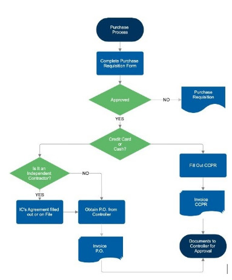

---
# **PSEUDOCÓDIGO**
Es un lenguaje de especificación de algoritmos. El uso de tal lenguaje hace el paso de codificación final (esto es, la traducción a un lenguaje de programación) relativamente fácil.

 El pseudocódigo nació como un lenguaje similar al inglés y era un medio representar básicamente las estructuras de control de programación estructurada.

Se considera un primer borrador, dado que el pseudocódigo tiene que traducirse posteriormente a un lenguaje de programación. Cabe señalar que el pseudocódigo no puede ser ejecutado por una computadora.
	
 La ventaja del pseudocódigo es que en su uso en la planificación de un programa, el programador se puede concentrar en la lógica y en las estructuras de control y no preocuparse de las reglas de un lenguaje específico.

```
 Secuencia
	Inicio
    	acción1
    	acción2
    	:
    	acción n 
	Fin 
```
### **Ejemplo:**
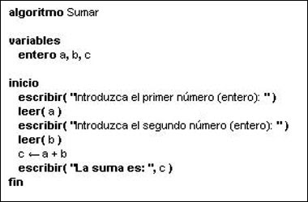

---
# **LA CREATIVIDAD Y BLOQUEOS MENTALES**


## **LA CREATIVIDAD**

¿Qué es la creatividad?
 Es llamada así a la capacidad de inventar algo nuevo, relacionar algo conocido de forma innovadora o de apartarse de los esquemas de pensamiento y conducta habituales. 

Para definir el concepto de creatividad es necesario conocer su raíz etimológica. La palabra creatividad deriva del latín “creare”, la cual está emparentada con “crecere”, lo que significa crecer; por lo tanto la palabra creatividad significa “crear de la nada”.


### **CREATIVIDAD CONFIABLE**

Todo hombre y mujer nace con el poder de resolver sus problemas creativamente, esta cualidad requiere expresión y práctica.

Todos confiamos en estar capacitados para hacer grandes obras, especialmente en un niño de 6 años, técnicas para Producir Ideas

Según el sociólogo italiano Vilfredo Pareto, existe 2 tipos de personas:

1. Especulador: 
Siempre esta preocupado por las posibilidades de nuevas 	combinaciones. Es el tipo de persona en cualquier campo de la 	actividad humana que nunca están contentas y siempre buscan la manera de modificar las cosas. 
		
Por ejemplo: Empresarios y los que hacen invenciones de todo 	género.

2. Accionista
Son las personas sin imaginación, rutinarias, conservadoras a las que manipula el especulador
Cuando se aprende un arte, lo primero que ha de estudiarse son los principios y en segundo lugar el método.  Esto también aplica a la producción de ideas. 

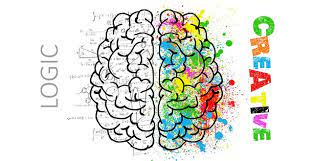

---
# **FALACIAS**

Argumentación incorrecta pero que aparentemente posee una fuerza de prueba que de hecho no tiene. Para detectarlas es preciso un especial atención a los contextos en que se desarrollan los diálogos y a las intenciones comunicativas de los hablantes.

En los estudios lógicos, se denomina con el término falacia aquella argumentación viciosa llamada también paralogismo y sofisma, pues, además de ser incorrecta, conlleva una fuerte dosis de persuasión psicológica. En tal sentido, la falacia es una forma de razonamiento que parece correcto, pero que resulta no serlo cuando se lo analiza cuidadosamente.

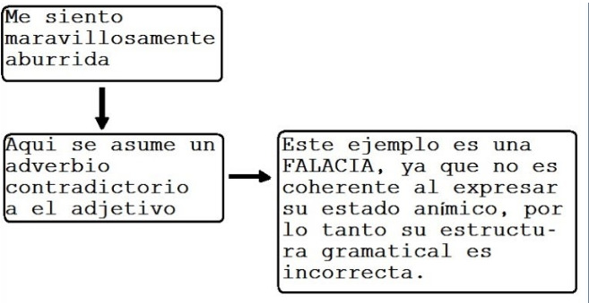

---

# **SILOGISMOS**

La inferencia (deductiva) que resulta del ordenamiento de dos proposiciones de las que se infiere una conclusión,  se llama  silogismo. 
Consta de tres proposiciones:
 *	Una premisa mayor.
 *	Una premisa menor.
 *	Una conclusión.

1. Cada  proposición consta de dos términos: sujeto y predicado y una cópula. 
2.	La proposición que lleva el término mayor en extensión o comprensión   (que incluye al otro en la conclusión) se llama premisa mayor. 
3.	La proposición que lleva el término menor, en la conclusión (en extensión o comprensión), se llama  premisa menor. 
3.	El tercer término que no figura  en la  conclusión es el término medio. 

### **Ejemplo 1:**

- NINGUN HEROE ES COBARDE.
- ALGUNOS SOLDADOS  SON COBARDES.
- POR LO TANTO, ALGUNOS SOLDADOS NO     SON HEROES. 

+  El termino “ soldado “ es el termino menor  
+ ( sujeto ), y  “ héroes “ es el termino mayor (predicado ).

### **Ejemplo 2:**

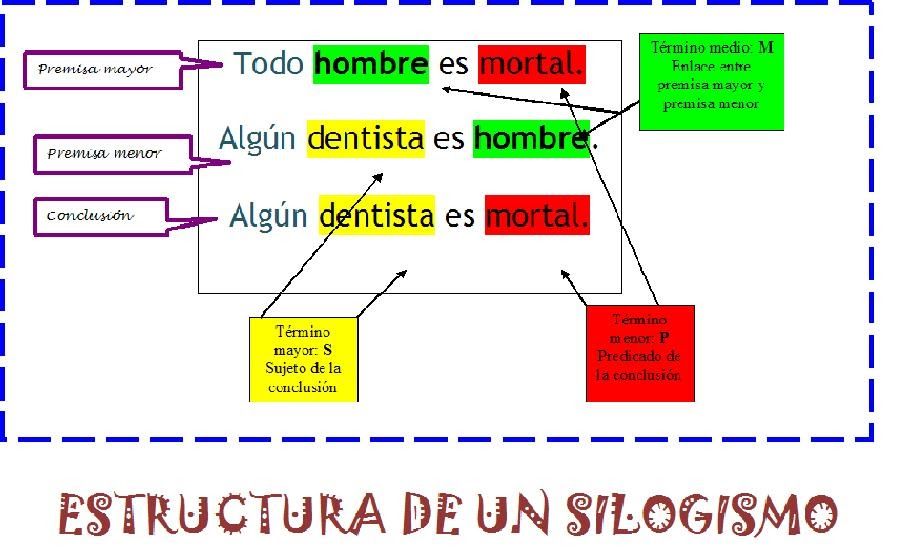

---

# **RAZONAMIENTO E INFERENCIA**
## **El Razonamiento o Argumento:**

**Es una estructura lógica formada por una o mas premisas y conclusión**. Si una estructura no posee conclusión, sea explicita o no, no es un argumento. De igual forma si tenemos conclusión sin premisa, tampoco es un argumento.

Un argumento puede tener las premisas implícitas, lo mismo que la conclusión; es decir, si solo se da la conclusión, esta nos puede conducir a una o mas premisas, de igual manera una o varias premisas nos dirigen hacia una conclusión que, aunque no la explicitemos esta contenida, lógicamente, en ella o ellas. Los razonamientos pueden ser validos o inválidos y no verdaderos o falsos.

### **Ejemplo 1:**

*	Los planetas son redondos, la Tierra es un planeta, por lo tanto; la Tierra es redonda

### **Ejemplo 2:**
*	Los moluscos son animales de cuerpo blando envueltos en un manto o piel molusca, protegidos por una cubierta calcárea. El caracol y la ostra están protegidos por una cubierta calcárea; por lo tanto el caracol y la ostra son moluscos.

### **Ejemplo 3:**

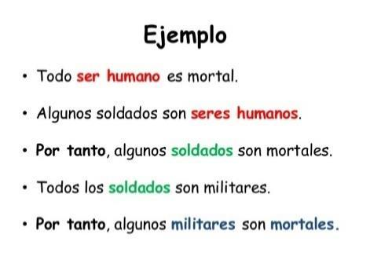
---
## **Reglas de Reemplazo**

Cuando tenemos una premisa que es equivalente a la conclusión
 Por ejemplo
* Si 4+3 = 7, entonces 3+4 = 7
* En las que las líneas de cierre son dobles indicando que ambas fórmulas son equivalentes, es decir, pueden sustituirse directamente una por otra puesto que su conexión es un bicondicional.

### **Ejemplo:**

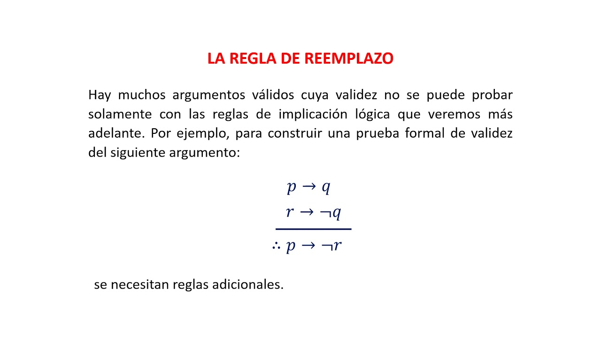

## **LEYES DE MORGAN (DM):**

Primera ley
Aplica esta ley para encontrar la negación de las proposiciones compuestas que siguen.

**Ejemplo 1:** La negación de María vino y Juan se quedó dormido es: María no vino o Juan no se quedóormido.

**Ejemplo 2:**

## **DOBLE NEGACIÓN (DN):**

“p doblemente negada equivale a p”

¬¬p ↔ p

Ejemplo: “No ocurre que Ana no es una estudiante”, entonces Ana es una estudiante.

## **Conmutación de la disyunción:**

Es cambiar el orden de las proposiciones.

Ejemplo: Es lunes o martes, luego es martes o lunes.

## **Conmutación de la conjunción:**

Es cambiar el orden de las proposiciones.
```
Ejemplo
Es el lunes y martes, luego es martes y lunes
Es el lunes y martes A /\ B
luego es martes y lunes B /\ A
A /\ B
B /\ A
```
## **Asociativa de la conjunción AC:**

Es agrupar las proposiciones.

Ejemplo

Hay clases el lunes, miércoles y viernes, 

Entonces hay clases el lunes y miércoles y el viernes

## **Asociativa de la disyunción AD:**

Agrupa a las disyunciones
```
Ejemplo
Ya sea el lunes o martes o miércoles luego es lunes o martes o sino el miércoles
Ya sea el lunes o martes o miércoles	    [A \/ (B \/ C)]
luego es lunes o martes o sino el miércoles [(A \/ B) \/ C]

[A \/ (B \/ C)]
[(A \/ B) \/ C]
```
## **Distributiva de la conjunción:**

El producto de varios números no varía sustituyendo 2 o más factores por su producto.
```
Ejemplo 
a(c+d) = ac+ad
```
## **Distributiva de la disyunción:**
```
Si a tiene 5 años, b 6 años y c 8 años, si sumamos la edad de a con la suma de la edad de b con c: 5 años + (6 años + 8 años) = 5 +14 =19 años,          [A \/ (B \/ C)]

el mismo resultado se obtiene si sumo primero las edades de a y b, y luego se suma con la edad de c.
(5 años + 6 años) + 8 años = 19 años [(A \/ B) \/ C]

[A \/ (B \/ C)]
[(A \/ B) \/ C]
```
## **Transposición:**
Pasar los datos de un lado a otro lado de la igualdad.
```
Ejemplo 
Si 6 es múltiplo de 3, entonces es divisible dentro de 3 luego si 7 no es múltiplo de 3 entonces 7 no es divisible dentro de 3
```
---

# **Reglas de Inferencia**

La inferencia es la forma en la que obtenemos conclusiones en base a datos y declaraciones establecidas.

### **Inductiva:**
La inferencia inductiva es la ley general que se obtiene de la observación de uno o más casos y no se puede asegurar que la conclusión sea verdadera en general.

### **Deductiva:**
Es deductiva cuando tenemos un caso que analiza todos los posibles resultados y de acuerdo a las premisas sólo hay una posible situación, en este caso decimos que la situación única es la conclusión. Estamos seguros de que si las premisas son verdaderas entonces la conclusión también lo es.

La inferencia deductiva es la única aceptada como válida en matemáticas y computación para hacer comprobaciones y sacar conclusiones.

### **Transductiva:**
Un maestro que llega tarde durante los primeros días y concluimos que el lunes siguiente también llegará tarde sería de particular a particular.

### **Abductiva:**
Es semejante a la deductiva, también utiliza la estrategia de analizar todas las posibilidades, pero en este caso hay varios casos que se pueden presentar.

**Reglas de Inferencia deductiva**
* **Modo Ponendo Pones (MPP)**
        Si tengo apendicitis, entonces me deben extraer el apéndice p → q
       Tengo apendicitis p
       Entonces me deben extraer el apéndice
```
p → q
p
q
```
 
 
- **Afirmar afirmando**
Identifica las premisas y la conclusión de

Si x = 2, entonces x2 = 4, mediante la argumentación MPP
 
- **Modus Tollendo tollens (MTT)**
Negar Negando
Se niega el consecuente entonces se niega la conclusión
```
Ejemplo
Si tengo apendicitis, entonces me deben extraer el apéndice y no me deben extraer el apéndice, entonces no tengo apendicitis.
Si tengo apendicitis, entonces me deben extraer el apéndice p → q
No me deben extraer el apéndice ¬ q
Entonces no tengo apendicitis ¬ p
p → ¬ q
¬ q
¬ p
```
* **MODUS TOLLENDO PONENS (TP)**
```
He ido al cine o me he ido de compras p V q
No he ido de compras   ¬q
Por tanto, he ido al cine p
p V q
¬q
P
```

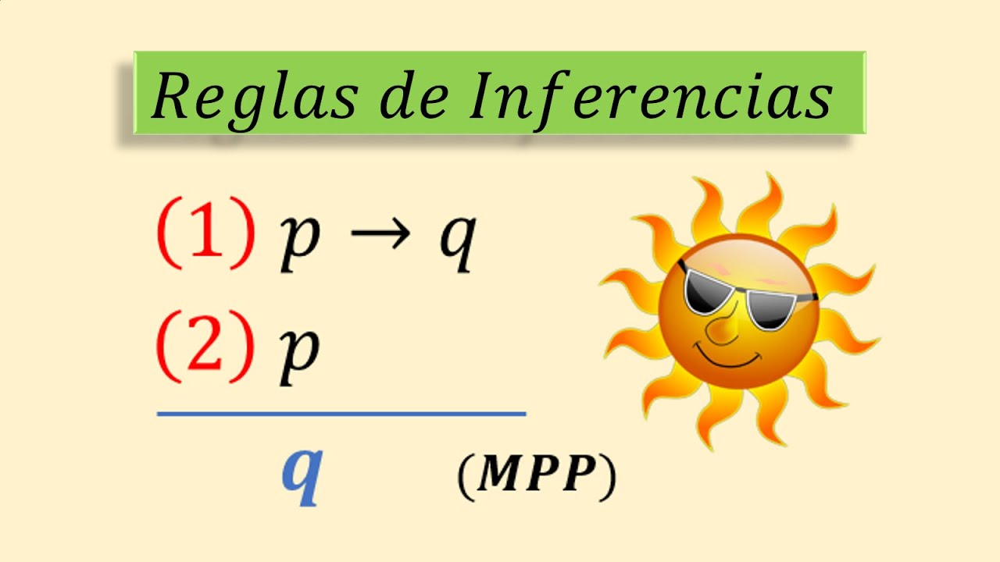
---
## **SILOGISMO HIPOTÉTICO (SH)**
* sí una causa se sigue una consecuencia, y esta consecuencia es a su vez causa de una segunda consecuencia, se puede decir que esa primera causa es causa de esa segunda consecuencia.
* El patrón de razonamiento consta de dos premisas condicionales. La consecuencia es otra proposición condicional.
* A esta ley se le llama también la regla de la cadena.

---

## **SILOGISMO DISYUNTIVO**
Dadas tres premisas, dos de ellas implicaciones, y la tercera una disyunción en la cual sus miembros son los antecedentes de los condicionales, podemos concluir en una nueva premisa en forma de disyunción, cuyos miembros serán los consecuentes de las dos implicaciones.

---

# **INCONSISTENCIA**
* Una formula bien formada (FBF), es inconsistente o insatisfacible, si no es consistente. En un conjunto de oraciones, si no todas son verdaderas, se dice que son inconsistentes. Ejemplo Hace frío. Llueve. Debo ir a clases y no hace frío. Es inconsistente, no existe posibilidad de que la primera y la tercera oración sean ambas verdaderas. •	En las demostraciones la inconsistencia es muy utilizada para demostrar que afirmaciones de la forma Todos o Ninguno, son falsas, encontrando un caso para el cual no se cumplen. •	A este procedimiento se le llama demostración por el contrario ejemplo También podemos utilizar las tablas de verdad para demostrar la inconsistencia de las proposiciones
```
Ejemplo:
        p˄~p 
Ejemplo:

Hace frío.

Llueve.

Debo ir a clases y no hace frío.
```
* Es inconsistente, no existe posibilidad de que la primera y la tercera oraciones sean ambas verdaderas.

* Nota que las oraciones que llevan Todo o ninguno y a éstos se les llama cuantificadores universales.

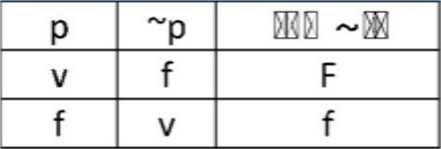

---

# **PRUEBA DE INVALIDEZ**

Un argumento es no válido o invalido corresponde a un condicional donde a veces el antecedente es verdadero y el consecuente es falso.
Un argumento inválido es equivalente a una proposición compuesta contingente.

¿Qué ocurre si el razonamiento es inválido?

1.	Ninguna combinación de reglas de inferencia y leyes de equivalencia, aplicadas a las premisas nos dará la conclusión.
2.	Si se asume lo contrario de la conclusión (es decir negamos la conclusión), y la tomamos como una premisa más, y aplicamos luego reglas y leyes a las premisas, no llegaremos a una contradicción.

Estas pruebas son sintácticas o de escritura, que no nos aseguran la invalidez, por lo que hay que proceder a un procedimiento semántico.

Si transformamos el argumento en un condicional, juntamos todas las premisas con conjunciones y le asignamos el valor falso a la conclusión, podemos asignarle valor verdadero a las premisas aunque tal vez necesitamos hacer varios intentos o viceversa, esta es la prueba de que el argumento es inválido. 

**Ejemplo 1:**
* Probar la invalidez del siguiente argumento por el método de asignar valores de verdad.

								f → r
								p → f 
								donde 
								f →p

* Para probar que este argumento es inválido sin tener que construir una tabla de verdad completa, es necesario tener claro que un condicional es falso solamente si su antecedente es verdadero y su consecuente falso.

* Se procede a asignar valores de verdad a las proposiciones de la conclusión, es decir, si F es verdadero y P es falso, entonces, la conclusión es falsa.

* Si a la proposición R se le asigna el valor verdadero, ambas premisas se convierten en verdaderas, porque un condicional es verdadero siempre que su consecuente sea verdadero. 

* Lo anterior permite afirmar que, si a las proposiciones F y R se les asigna un valor verdadero y a la proposición P un valor falso, entonces el argumento tendrá premisas verdaderas y una conclusión falsa, con lo cual queda probado que el argumento es inválido.

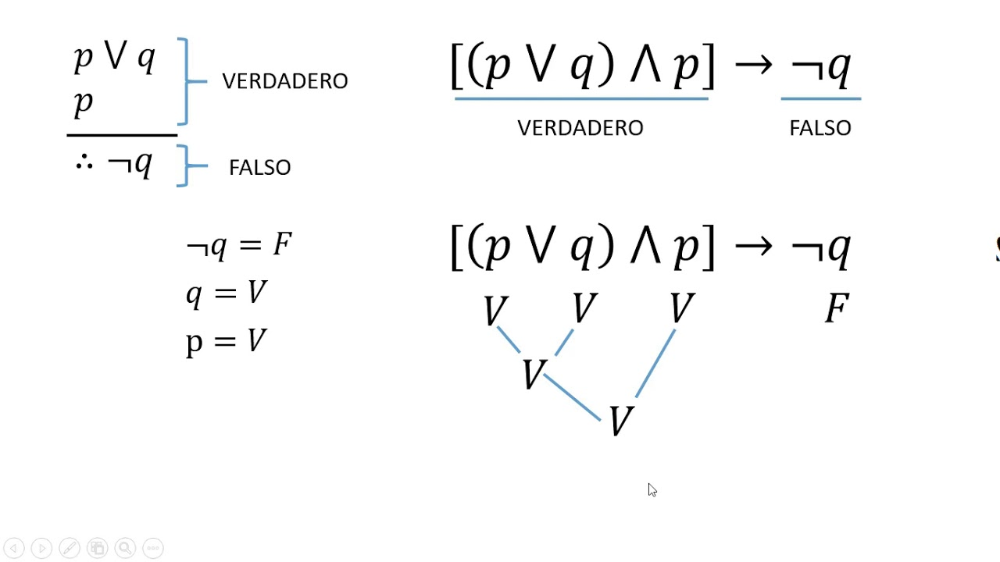

---

# **Regla de Demostración Condicional**
Una demostración de un teorema es una verificación escrita que muestra que el teorema es verdadero. Informalmente, desde el punto de vista lógico, una demostración de un teorema es un argumento lógico que establece la verdad del teorema. Consiste de una sucesión de afirmación 1,2,...n, tales que cada afirmación tiene una o más razones que justifican su validez, que pueden ser hipótesis, definiciones, afirmaciones anteriores en la misma demostración o proposiciones matemáticas ya demostradas y además la última afirmación, n, es la que queremos demostrar. 

Se da una oración  por supuesta que es la oración antecedente.

Una variante de la demostración condicional es la indirecta o apagógica (reducción a lo absurdo).

* Regla para una demostración por el método indirecto.
	* Se formula el teorema en términos de una proposición condicional p → q.

	* Se acepta que p es verdadera y se niega la proposición q que se desea probar.

	* Se recopilan definiciones, postulados o teoremas ya demostrados, que van a intentar encadenarse lógicamente incluido ~ q.

	* Se efectúa una cadena de argumentaciones lógicamente válidas que lleven a una contradicción de un hecho conocido o de la proposición p.

	* Se concluye que la suposición ~ q es falsa, por lo tanto q es verdadera.

	* Se afirma lo demostrado: la proposición q.

**Ejemplo**

* Demostrar por reducción a lo absurdo lo siguiente:
	* Se formula el teorema en términos de una proposición condicional p → q.
	* Se acepta que p es verdadera y se niega la proposición q que se desea probar.
	* Se recopilan definiciones, postulados o teoremas ya demostrados, que van a intentar encadenarse lógicamente incluido ~ q.
	* Se efectúa una cadena de argumentaciones lógicamente válidas que lleven a una contradicción de un hecho conocido o de la proposición p.
	* Se concluye que la suposición ~ q es falsa, por lo tanto q es verdadera.
	* Se afirma lo demostrado: la proposición q.

**EJEMPLO**

* Demostrar por reducción a lo absurdo lo siguiente:
	* Si dos rectas diferentes se intersecan, su intersección contiene solamente un punto.
* Reformulación:
	* Dadas las rectas l y m que se intersecan.
	* Demostraremos que l y m se intersecan en un sólo punto.
* Negación de lo que se va a demostrar: 
	* l y m se intersecan en más de un punto.
* Se utilizan las definiciones, postulados o teoremas ya demostrados:
	* Postulado de la recta:
		* Dos puntos están contenidos en una única recta.
	* Negación de la conclusión:
		* l y m se intersecan en dos puntos.
* Cadena de Argumentos:

La demostración condicional se aplica cuando el resultado es una implicación o condicional

* Ejemplo:

I ˅ ~ J
~ (~ K ˄ L)
~ (~ I ˄ ~ L)
~ J →  K

* Comprobar el argumento mediante el método de demostración condicional es muy sencillo.

* Se coloca como otra premisa el antecedente de la conclusión, que para el ejemplo es ~ J y la conclusión es K.

* SD significa silogismos disyuntivo.
	p ˅ ~ q → ~ q 

* De M significa Morgan.

* C D condicional Disyuncional.
	p → q  ↔ ~ p ˅ q

* M P modus ponendo ponens.

---

# **Proposiciones**

Debemos hacer una distinción entre “frases” y “proposición”. La frase es el conjunto  de letras o sonidos, es una forma lingüística en un idioma determinado que puede ser que exprese una proposición. La proposición es el pensamiento completo que describe algún hecho o aspecto del mundo.

Por lo que la definición formal de proposición es: **La unidad semántica de la cual podemos decir que es verdadera o falsa.**

Las frases expresivas pueden ser sinceras o ilegitimas, pero no verdaderas o falsas.

Las ordenes o recomendaciones tampoco pueden ser verdaderas o falsas, decimos que son juiciosas o insensatas.

“Falsedad”  o “Verdad” **son términos de lógica con carácter técnico.** “Verdad”, **es la propiedad de la unidad semántica que describe adecuadamente al mundo. Ese valor es lo que mas interesa al lógico sobre una proposición.**

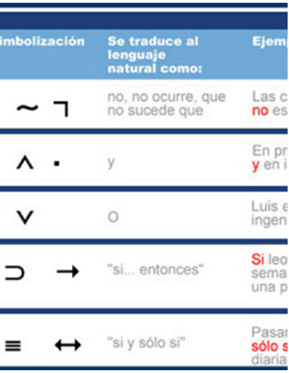
---

# **METODO DE DEDUCCIÓN**

## **Prueba de Validez:**

* El razonamiento lógico se aplica en todas las actividades humanas, en las actividades cotidianas:
	* Cuando defendemos nuestros puntos de vista.
	* Al intentar convencer a alguien de alguna idea.

Para esto necesitamos usar los argumentos lógicos en forma coherente y solo así seremos atendidos.

### **Técnicas de la tabla de verdad:**

* Para esto debemos utilizar las proposiciones condicionales, en donde el conjunto de premisas forma el antecedente y la conclusión el consecuente.

* Si el resultado es tautología se considera un razonamiento válido de lo contrario será invalido.

* Ejemplo:

Si la tierra es un planeta, entonces no posee luz propia. La tierra es un planeta. Por lo tanto no posee luz propia.

1. Procedemos a representar la oración en forma simbólica


